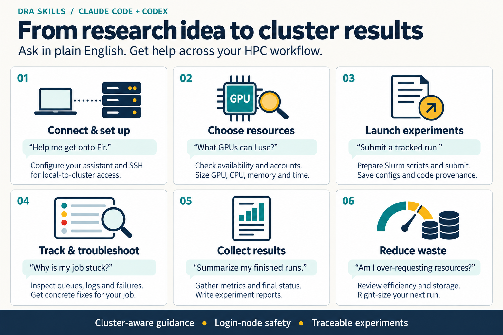

# Skills for Digital Research Alliance

This skill set teaches Claude Code and/or Codex about our Slurm clusters, storage rules,
login-node safety, experiment conventions, and reusable HPC workflows.



## Recommended Setup

### Run the tool you want to use at least once

- Claude Code: run `claude` and log in with `/login`
- Codex: run `codex` and log in

### Clone this repo:

```bash
git clone https://github.com/medfm-flare/DRA-skills ~/DRA-config
```

### Open Claude Code or Codex and say:

```text
Read ~/DRA-config/README.md and install the lab config for me.
Configure Claude Code, Codex, or both depending on what is available.
```

The assistant should inspect this repo, detect the Alliance cluster (e.g. Fir), write saved setup values, and run `setup.sh`.

## Manual Setup

Use this if you want to run the installer yourself:

```bash
cd ~/DRA-config

# Claude Code only (default)
./setup.sh --modules fir --targets claude

# Codex only
./setup.sh --modules fir --targets codex

# Both
./setup.sh --modules fir --targets codex,claude
```

If you are on a cluster login node, `setup.sh` can usually auto-detect modules. Use `--modules` when you want to be
explicit.

## What Gets Installed

| Target      | Installed config                                                    | Reusable workflows                         |
|-------------|---------------------------------------------------------------------|--------------------------------------------|
| Claude Code | `~/.claude/CLAUDE.md`, generated `settings.json`, statusline, hooks | `~/.claude/skills/*`, `~/.claude/agents/*` |
| Codex       | `~/.codex/AGENTS.md`                                                | `~/.codex/skills/*`                        |

Shared workflows include:

- `ccdb-clusters` - Alliance-wide cluster mechanics, storage, billing, Python install guidance, and fair-share helper scripts.
- `onboard` - interactive setup helper.
- `slurm-status` - check GPU/resource availability.
- `slurm-job` - create or modify sbatch scripts.
- `slurm-seff-report` - add reporting matched to the job shape; use post-completion `seff` for final accounting.
- `slurm-debug` - diagnose failed, killed, or pending jobs.
- `submit-experiment` - submit documented Slurm experiments.
- `harvest` - collect completed experiment results.
- `connect` - establish/verify key-based SSH access to the cluster (one-time key upload done by `onboard`).
- `slurm-queue`, `slurm-resource`, `slurm-storage` - Claude agents converted into Codex skills where needed.

Claude supports hooks/statusline directly. Codex does not, so login-node safety and tool usage rules are injected into
`AGENTS.md` instead.

## Updating

```bash
cd ~/DRA-config
git pull
./setup.sh --targets <same-targets-you-installed>
```

For example, use `--targets claude` for Claude Code only, `--targets codex` for Codex only, or `--targets claude,codex`
if both tools are initialized. Or ask Claude Code/Codex to read this README and update the lab config for you.

## Uninstalling

```bash
cd ~/DRA-config
./uninstall.sh
```

This removes repo-owned symlinks and strips the managed lab block from `~/.claude/CLAUDE.md` and `~/.codex/AGENTS.md`.
Personal content outside the markers is preserved. Backups are kept under `~/.claude/backups/` and `~/.codex/backups/`.

## Source Layout

The repo uses a core-plus-adapter design:

```text
shared/instructions/core.md      # Lab facts shared by Claude Code and Codex
shared/instructions/claude.md    # Claude-specific commands, hooks, agents
shared/instructions/codex.md     # Codex-specific AGENTS.md and skill guidance

modules/<cluster>/instructions/core.md
modules/<cluster>/instructions/claude.md  # optional tool-specific differences
modules/<cluster>/instructions/codex.md   # optional tool-specific differences

shared/skills/                   # Shared skills
shared/codex/skills/             # Codex-only skill adapters
shared/agents/                   # Claude agents, converted to Codex skills
shared/hooks/                    # Claude-only hooks
shared/settings.json             # Claude-only settings template
```

Why this shape:

- Shared cluster/storage policy lives once, so Claude and Codex do not drift.
- Tool-specific behavior stays in small adapter files.
- The installer is slightly more compositional, but future tools can be added without duplicating all lab policy.

## Skill Authoring

Claude Code and Codex are both supported. Shared skills contain tool-neutral HPC
guidance; each tool retains its own adapters and installation path, including
Claude's agents, settings, and hooks. The shared clarity and selective-loading
improvements draw on OpenAI's [GPT-6 Astra skills and prompts guidance](https://developers.openai.com/blog/rethinking-skills-and-prompts-for-gpt-6-astra)
without requiring a particular model or replacing Claude's interface.

- **Describe the routing boundary.** Keep each description short: what it does and
  when it applies. Avoid broad keyword triggers, mandatory wording, and duplicated
  capability catalogs in always-loaded instructions.
- **Load detail when needed.** Put shared constraints and outcome criteria in
  `SKILL.md`; link platform recipes, schemas, and substantial examples from the
  relevant decision point. Simple skills can stay self-contained.
- **Preserve operational requirements.** Login-node discipline, Fir GPU syntax,
  authentication boundaries, and reproducible run records remain explicit. Treat
  old measurements and example resource sizes as evidence to assess, not universal gates.
- **Honor task scope.** Complete authorized preparation and file updates without
  repeated approval. Check authorization at job launch, cancellation, data mutation,
  or publication. A preview remains read-only; uncertain submissions must be
  reconciled before retrying.
- **Keep shared truth in one place.** `metadata.yaml` owns run status; the canonical
  schema lives with `submit-experiment`. Tool adapters should express real tool
  differences, not repeat cluster policy.
- **Use portable paths.** Resolve references from the loaded skill directory and
  use absolute helper paths. `${CLAUDE_SKILL_DIR}` is available in Claude; Codex
  should resolve the skill's installed location instead of assuming that variable.
- **Validate the changed behavior.** Check frontmatter, packaged references, and
  installation with `python3 evals/validate_bundle.py` (requires PyYAML and the
  installer's `jq`). These tests use disposable fixture directories, no SSH or
  Slurm jobs, and do not modify the user's assistant configuration. Use
  `evals/routing-trigger.json` separately in a fresh model session to evaluate
  routing and decision boundaries; structural checks do not prove model behavior.

### Authorization compatibility

`harvest` now treats a request to update experiment records as authorization for
those updates; `--auto` remains supported. A preview request still writes nothing.
`submit-experiment` prepares a concrete run before any missing launch approval and
does not ask again for a run whose resource bounds are already authorized. Its
schema distinguishes prepared, rejected, and uncertain submissions from accepted jobs.

### References

- [OpenAI: Rethinking skills and prompts for GPT-6 Astra](https://developers.openai.com/blog/rethinking-skills-and-prompts-for-gpt-6-astra)
- [Anthropic: Agent Skills](https://docs.anthropic.com/en/docs/claude-code/skills)

## Contributing

Common changes:

- New cluster: add `modules/<name>/instructions/core.md`, optional `claude.md` / `codex.md`, and optional skill
  templates.
- New reusable workflow: add it under `shared/skills/`.
- Claude-only automation: use `shared/hooks/`, `shared/agents/`, or `shared/settings.json`.
- Codex-only adaptation: use `shared/codex/`.

Keep durable lab facts in `core.md`; keep tool syntax in the adapter files.
